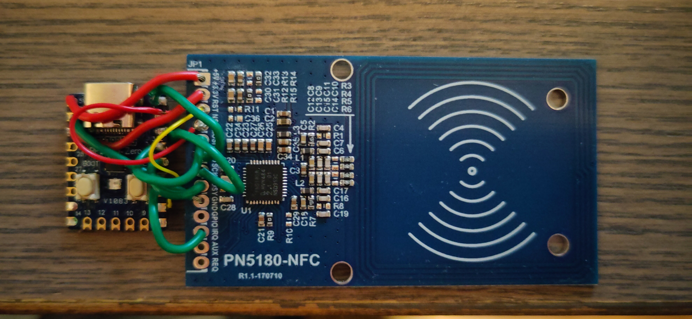

<!--
SPDX-FileCopyrightText: 2025 PN5180-tagomatic contributors
SPDX-License-Identifier: GPL-3.0-or-later
-->

# PN5180 RFID Reader Firmware

This directory contains the Arduino sketch for the Raspberry Pi Pico
firmware that interfaces with the PN5180 NFC module.

## Hardware Requirements

- USB cable for connection to host computer
- Raspberry Pi Pico (the pins will need to be modified) or Raspberry Pi Pico Zero
- PN5180 NFC Frontend Module card

My prototype board with horrible soldering:


## Pin Connections

| PN5180 Pin | Raspberry Pi Pico Zero Pin |
|------------|----------------------------|
| NSS        | GP5                        |
| BUSY       | GP4                        |
| RST        | GP7                        |
| MOSI       | GP3 (SPI0 TX)              |
| MISO       | GP0 (SPI0 RX)              |
| SCK        | GP2 (SPI0 SCK)             |
| +3.3V      | 3.3V                       |
| +5V        | 5V                         |
| GND        | GND                        |
| GPIO       | -                          |
| IRQ        | GP6                        |
| AUX        | -                          |
| REQ        | -                          |

## Building and Uploading

### Prerequisites

The firmware requires the PN5180, FastLED and SimpleRPC libraries.
Install them using one of these methods:

**Arduino IDE:**
1. Go to Sketch > Include Library > Manage Libraries
2. Search for the libraries and install them.

**Arduino CLI:**
```bash
arduino-cli lib install simpleRPC
arduino-cli lib install FastLED
arduino-cli lib install PN5180
```

### Using Arduino IDE

1. Install the Arduino IDE
2. Add Raspberry Pi Pico board support:
   - Go to Tools > Board > Board Manager
   - Search for "pico" and install "Arduino Mbed OS RP2040 Boards by Arduino" (version 4.4.1 was used).
3. Install the libraries (see Prerequisites above)
4. Press the select board pulldown: "Select Other Board and Port"
5. Search for pico, choose "Raspberry Pi Pico Zero"
5. Select Port: Tools > Port > (your Pico's port)
6. Upload the sketch (the arrow)

### Using Arduino CLI

This is untested...

```bash
# Install board support
arduino-cli core install rp2040:rp2040

# Install the libraries, see [Prerequisites]:
arduino-cli lib install ...

# Compile
arduino-cli compile --fqbn rp2040:rp2040:rpipico firmware/pn5180_reader

# Upload (replace /dev/ttyACM0 with your port)
arduino-cli upload -p /dev/ttyACM0 --fqbn rp2040:rp2040:rpipico firmware/pn5180_reader
```

## Protocol

The firmware communicates with the host computer over USB serial at 115200 baud using the SimpleRPC protocol.

### Available Functions

See the code for their documentations

### SimpleRPC

SimpleRPC is a simple RPC (Remote Procedure Call) protocol for Arduino that allows Python programs to call Arduino functions over serial. The protocol is documented at: https://simplerpc.readthedocs.io/
